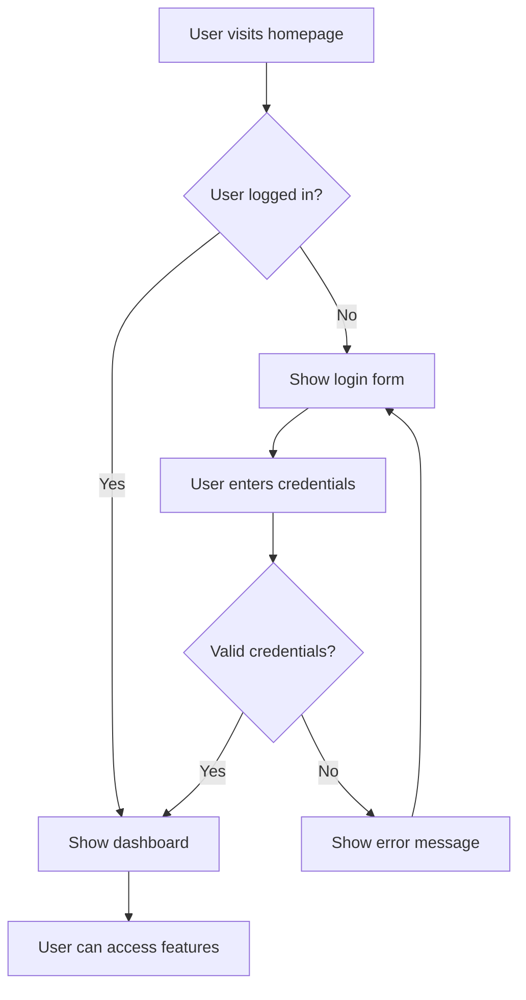
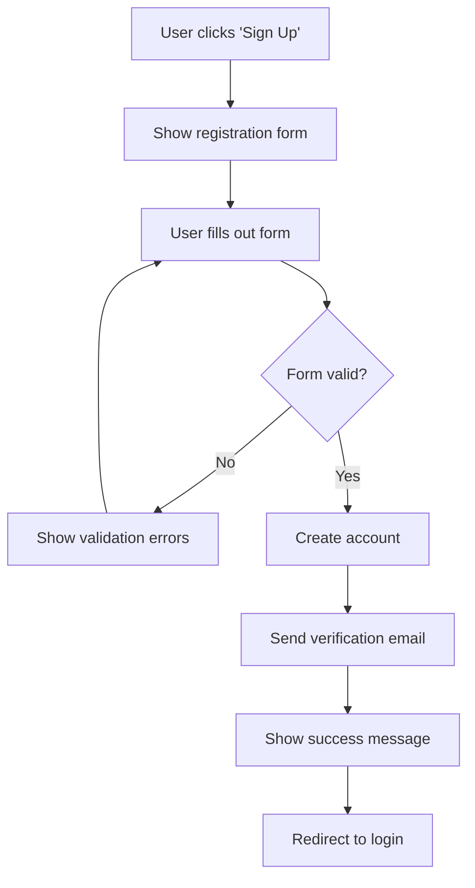

# Agile Development with AI

Agile is a popular approach to project management, especially in software development. It emphasizes flexibility, collaboration, and continuous improvement. AI can significantly enhance an Agile workflow.

## Epics and User Stories: Breaking Down Features

### Epics
An Epic is a large body of work that can be broken down into smaller tasks (user stories). It's a high-level goal.

**Example Epic**: "As a user, I want to manage my entire fitness journey in one app."

**Characteristics of Epics:**
- **High-level goals**: Broad objectives that span multiple features
- **Long timeframes**: Can take weeks or months to complete
- **Multiple user stories**: Contain many smaller, manageable tasks
- **Strategic value**: Align with business objectives and user needs

### User Stories
A User Story is a short, simple description of a feature told from the perspective of the user. It follows the format: "As a [type of user], I want [some goal] so that [some reason/benefit]."

**Example User Story**: "As a busy professional, I want to log my daily workouts easily so I can track my progress without hassle."

**Components of a User Story:**
- **User**: Who is this feature for?
- **Goal**: What do they want to accomplish?
- **Benefit**: Why do they want this? What value does it provide?

### Why it's important for Vibe Coding
These help you clearly define small, manageable chunks of work for yourself and for the AI. AI can even help you break down Epics into User Stories, or generate code based on a User Story.

**Analogy**: An Epic is like "Build a treehouse." User stories are the smaller tasks like "Build the floor," "Add a ladder," "Install a window."

### Writing Effective User Stories

#### INVEST Criteria
- **Independent**: Can be developed and tested independently
- **Negotiable**: Details can be discussed and refined
- **Valuable**: Provides value to the user or business
- **Estimable**: Can be sized and planned
- **Small**: Can be completed in a single iteration
- **Testable**: Can be verified that it works correctly

#### Example User Stories for a Fitness App
```
Epic: Fitness Journey Management

User Stories:
1. As a user, I want to create an account so I can save my progress
2. As a user, I want to log a workout so I can track my activities
3. As a user, I want to view my workout history so I can see my progress
4. As a user, I want to set fitness goals so I can stay motivated
5. As a user, I want to receive workout reminders so I don't forget to exercise
```

### How AI Helps with User Stories

#### Breaking Down Epics
- **Ask AI**: "Break down this epic into user stories: [Epic description]"
- **AI can suggest**: Logical groupings and dependencies
- **AI can identify**: Missing user stories or edge cases
- **AI can prioritize**: Stories based on value and complexity

#### Generating User Stories
- **Provide context**: "I'm building a [type of app] for [target users]"
- **Ask for stories**: "Generate user stories for the [feature] functionality"
- **Refine with AI**: "Make this user story more specific" or "Add acceptance criteria"

#### Acceptance Criteria
AI can help define what "done" looks like for each user story:
- **Given**: The initial state or context
- **When**: The action the user takes
- **Then**: The expected outcome

## User Flow Diagrams: Mapping the User Journey with Mermaid

### What it is
A user flow diagram visually represents the path a user takes to complete a task within your application. It shows the screens they'll see and the actions they'll take.

### Mermaid
A simple text-based tool that allows you to create diagrams (like flowcharts) using plain text, which can then be rendered visually. AI tools can often generate Mermaid code from your descriptions.

### Why it's important
Helps you visualize the user's experience, identify potential roadblocks, and ensure a smooth, intuitive journey.

**Analogy**: This is like drawing a map of how someone will navigate through a maze, showing every turn and decision point.

### Basic Mermaid Syntax

#### Flowchart Example


#### User Registration Flow


### How AI Helps with User Flows

#### Generating Flow Diagrams
- **Describe the flow**: "Create a user flow for user registration"
- **AI generates**: Mermaid code for the diagram
- **Iterate**: "Add error handling to this flow"
- **Refine**: "Make this flow more user-friendly"

#### Identifying Issues
- **AI can spot**: Unnecessary steps or confusing paths
- **AI can suggest**: Better user experience patterns
- **AI can identify**: Missing error states or edge cases
- **AI can recommend**: Industry best practices

### Best Practices for User Flows

#### Keep it Simple
- **Start with happy path**: The most common user journey
- **Add error states**: What happens when things go wrong
- **Consider edge cases**: Unusual but possible scenarios
- **Limit decision points**: Too many choices can confuse users

#### Focus on User Goals
- **Map to user stories**: Each flow should support a user goal
- **Minimize steps**: Reduce friction in the user journey
- **Provide feedback**: Users should know where they are and what's happening
- **Allow recovery**: Users should be able to go back or correct mistakes

## Wireframing: Low-fidelity Design Concepts

### What it is
Wireframing is creating a basic, skeletal outline of a webpage or app screen. It focuses on layout, content placement, and functionality, rather than visual aesthetics. Think of it as a rough sketch.

### Why it's important
It allows you to quickly experiment with different layouts and information hierarchies without getting bogged down in design details. You can get feedback on the structure before adding colors and images.

**Analogy**: This is like drawing a simple floor plan of a house with just boxes for rooms and lines for doors, without worrying about furniture or wall colors yet.

### Wireframing Tools

#### Digital Tools
- **Figma**: Popular for collaborative wireframing
- **Sketch**: Mac-based design tool
- **Adobe XD**: Part of Adobe Creative Suite
- **Balsamiq**: Specifically designed for wireframing

#### AI-Enhanced Tools
- **v0 by Vercel**: Generate UI components from descriptions
- **Figma AI plugins**: Create wireframes from text descriptions
- **ChatGPT**: Describe layouts and get suggestions
- **Midjourney**: Generate visual concepts for layouts

### Wireframing Best Practices

#### Start with Structure
- **Content hierarchy**: What's most important?
- **Navigation**: How do users move around?
- **Layout grid**: How is information organized?
- **Interactive elements**: Buttons, forms, links

#### Keep it Simple
- **Use simple shapes**: Rectangles, circles, lines
- **Minimal text**: Just enough to understand the content
- **No colors**: Focus on layout, not aesthetics
- **Consistent symbols**: Use the same symbols for similar elements

#### Focus on Functionality
- **User goals**: Does the layout support user tasks?
- **Information flow**: Is the content organized logically?
- **Interaction patterns**: Are buttons and links where users expect them?
- **Mobile considerations**: How does it work on smaller screens?

### How AI Helps with Wireframing

#### Generating Layouts
- **Describe the screen**: "Create a wireframe for a user dashboard"
- **AI suggests**: Layout structure and component placement
- **AI identifies**: Common patterns and best practices
- **AI generates**: Multiple layout options to choose from

#### Rapid Iteration
- **Quick changes**: "Move the navigation to the top"
- **Alternative layouts**: "Show me a sidebar navigation version"
- **Component suggestions**: "What should go in the header?"
- **Responsive considerations**: "How should this look on mobile?"

## Prototyping: Testing Ideas Quickly

### What it is
A prototype is an early, often interactive, version of a product or feature. It can range from a clickable wireframe to a more visually refined mock-up that simulates the user experience.

### Why it's important
Prototypes allow you to test your ideas with real users and gather feedback before you build the full product. This helps you validate assumptions and make necessary adjustments early on, saving time and resources. AI tools can help generate interactive prototypes quickly.

**Analogy**: This is like creating a temporary, walk-through model of a house out of cardboard and tape to see if the layout feels right before starting actual construction.

### Types of Prototypes

#### Low-Fidelity Prototypes
- **Paper sketches**: Hand-drawn mockups
- **Digital wireframes**: Basic layouts without styling
- **Clickable wireframes**: Wireframes with basic interactions
- **Purpose**: Test structure and flow

#### Medium-Fidelity Prototypes
- **Styled wireframes**: More visual detail
- **Interactive mockups**: Clickable with realistic interactions
- **Limited functionality**: Some working features
- **Purpose**: Test user experience and design

#### High-Fidelity Prototypes
- **Near-final design**: Close to production appearance
- **Full functionality**: Most features working
- **Real data**: Using actual content
- **Purpose**: Final validation before development

### Prototyping Tools

#### Traditional Tools
- **Figma**: Excellent for interactive prototypes
- **Adobe XD**: Good for complex interactions
- **Sketch**: Popular for Mac users
- **InVision**: Great for sharing and collaboration

#### AI-Enhanced Tools
- **Framer**: AI-assisted prototyping
- **Bolt.new**: Generate working prototypes from descriptions
- **v0**: Create interactive components quickly
- **ChatGPT**: Get prototyping suggestions and guidance

### How AI Helps with Prototyping

#### Rapid Generation
- **Describe the prototype**: "Create a prototype for a task management app"
- **AI generates**: Interactive components and layouts
- **AI suggests**: User flows and interactions
- **AI creates**: Multiple variations to test

#### User Testing Support
- **Generate test scenarios**: AI can create user testing scripts
- **Analyze feedback**: AI can help interpret user responses
- **Suggest improvements**: AI can recommend changes based on patterns
- **Create documentation**: AI can document findings and next steps

### Prototyping Best Practices

#### Start Simple
- **Begin with low-fidelity**: Don't over-invest in early prototypes
- **Focus on core features**: Test the most important functionality first
- **Iterate quickly**: Make changes based on feedback
- **Test with real users**: Get feedback from your target audience

#### Test the Right Things
- **User flows**: Can users complete their goals?
- **Information architecture**: Is content organized logically?
- **Interaction patterns**: Are controls intuitive?
- **Content clarity**: Is the messaging clear?

#### Document Learnings
- **Record feedback**: What did users say and do?
- **Identify patterns**: What issues came up repeatedly?
- **Plan iterations**: What changes should you make?
- **Share insights**: Communicate findings with stakeholders

## How These Concepts Help with Vibe Coding

### Better Project Planning
Understanding Agile concepts helps you:
- **Break down complex projects** into manageable pieces
- **Plan iterations** and set realistic timelines
- **Prioritize work** based on user value
- **Adapt to changes** and feedback quickly

### More Effective AI Collaboration
When you understand Agile development, you can:
- **Give AI clear, specific tasks** (user stories)
- **Iterate quickly** with AI-generated prototypes
- **Test assumptions** before building full features
- **Collaborate effectively** with AI on complex projects

### Building Better Products
These practices ensure you:
- **Focus on user value** rather than technical features
- **Validate ideas early** before investing heavily
- **Build iteratively** based on real feedback
- **Deliver working software** quickly and frequently

## Key Takeaways

- **Epics and user stories** help break down complex projects into manageable pieces
- **User flow diagrams** visualize the user journey and identify potential issues
- **Wireframing** allows quick experimentation with layouts and structure
- **Prototyping** enables testing ideas with real users before full development
- **AI can enhance** every aspect of Agile development
- **Start simple** and iterate based on feedback
- **Focus on user value** rather than technical perfection
- **Test early and often** to validate assumptions

In the next lesson, we'll explore Business Models for SaaS - how to create sustainable revenue streams and build successful software businesses. 