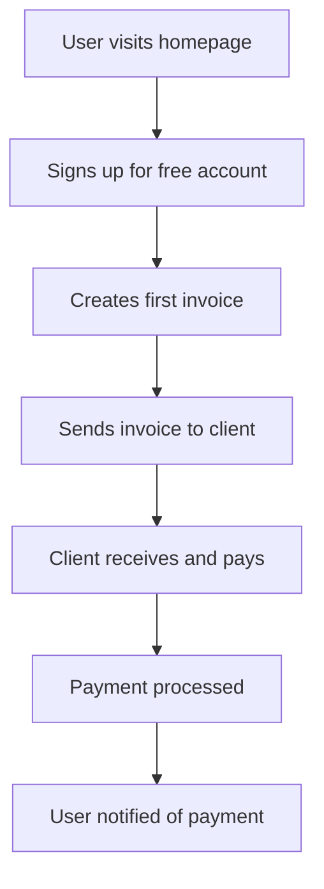

# Project: Create a Product Specification

For your project in this module, you will apply the concepts learned by creating a product specification for a hypothetical SaaS project. This will involve:

- Defining your target user (from User Research)
- Identifying a problem your SaaS product will solve
- Outlining the core features of your MVP (from MVP Strategy)
- Suggesting a primary business model (from Subscription Models)
- Drafting a simple Product Requirements Document (PRD) that summarizes these points

This project will help you integrate the business and product thinking into your Vibe Coding journey, preparing you to build solutions that not only work but also thrive.

## Project Overview

You'll create a comprehensive product specification for a SaaS application of your choice. This project will demonstrate your understanding of the business and product concepts we've covered, and prepare you to build real solutions with Vibe Coding.

## Step 1: Choose Your SaaS Product Idea

### Product Categories to Consider

#### Productivity Tools
- **Task Management**: Advanced to-do lists with team collaboration
- **Time Tracking**: Automated time tracking for freelancers and teams
- **Note-taking**: Collaborative note-taking with AI assistance
- **Project Management**: Simplified project management for small teams

#### Business Tools
- **Invoice Management**: Automated invoicing and payment tracking
- **Customer Relationship Management (CRM)**: Simple CRM for small businesses
- **Inventory Management**: Track inventory for small retailers
- **Social Media Management**: Schedule and analyze social media posts

#### Creative Tools
- **Design Collaboration**: Collaborative design tools for teams
- **Content Creation**: AI-assisted content creation platform
- **Video Editing**: Simple online video editing tools
- **Portfolio Builder**: Easy portfolio creation for creatives

#### Health & Wellness
- **Fitness Tracking**: Personalized workout and nutrition planning
- **Mental Health**: Meditation and mindfulness tracking
- **Sleep Tracking**: Sleep analysis and improvement recommendations
- **Nutrition Planning**: Meal planning and nutrition tracking

### Selection Criteria
Choose a product that:
- **Solves a real problem** you understand
- **Has a clear target market** you can research
- **Is feasible to build** with Vibe Coding tools
- **Has potential for monetization** through subscriptions
- **Interests you personally** (you'll be working on it!)

## Step 2: Define Your Target User

### User Research Questions

#### Demographics
- **Age range**: What age group are you targeting?
- **Location**: Where are your users located?
- **Income level**: What's their financial situation?
- **Education**: What's their educational background?

#### Psychographics
- **Lifestyle**: How do they spend their time?
- **Values**: What's important to them?
- **Pain points**: What frustrates them daily?
- **Goals**: What are they trying to achieve?

#### Technical Profile
- **Tech comfort level**: How comfortable are they with technology?
- **Device usage**: What devices do they use most?
- **Existing tools**: What tools do they currently use?
- **Learning style**: How do they prefer to learn new things?

### Create User Personas
Develop 2-3 detailed user personas that represent your target audience:

```
Persona: Sarah, the Busy Professional
- Age: 32
- Job: Marketing Manager at a small company
- Pain points: Overwhelmed with tasks, hard to track progress
- Goals: Better organization, more productivity
- Tech comfort: Intermediate
- Current tools: Email, spreadsheets, sticky notes
```

## Step 3: Identify the Problem

### Problem Statement Framework

#### Current State
- **What are users doing now** to solve this problem?
- **What tools are they using** (if any)?
- **What's frustrating** about current solutions?
- **How much time/money** does this problem cost them?

#### Desired State
- **What would make their life easier**?
- **What would success look like** for them?
- **What would they be willing to pay for**?
- **How would this improve their daily life**?

#### Problem Validation
- **Market size**: How many people have this problem?
- **Urgency**: How badly do they need a solution?
- **Willingness to pay**: Are they willing to pay for a solution?
- **Competition**: What solutions already exist?

### Example Problem Statement
"Small business owners spend 5-10 hours per week manually creating and tracking invoices, leading to delayed payments and cash flow issues. They need a simple, automated invoicing solution that integrates with their existing tools and helps them get paid faster."

## Step 4: Define Your MVP Features

### MVP Feature Selection

#### Core Value Features
- **Must-have features** that solve the main problem
- **Features that differentiate** you from competitors
- **Features that provide immediate value** to users
- **Features that can be built quickly** with Vibe Coding tools

#### Nice-to-Have Features (Future)
- **Advanced features** for power users
- **Integration features** with other tools
- **Analytics and reporting** features
- **Team collaboration** features

### Feature Prioritization Matrix

| Feature | User Value | Development Effort | Priority |
|---------|------------|-------------------|----------|
| User registration | High | Low | High |
| Core functionality | High | Medium | High |
| Basic reporting | Medium | Low | Medium |
| Advanced analytics | Medium | High | Low |

### Example MVP Features for Invoicing App
1. **User registration and login**
2. **Create and send invoices**
3. **Track payment status**
4. **Basic payment processing**
5. **Email notifications**
6. **Simple dashboard**

## Step 5: Choose Your Business Model

### Subscription Model Selection

#### Freemium Model
- **Free tier**: Basic features for individual users
- **Paid tier**: Advanced features for power users
- **Conversion strategy**: How will you convert free to paid?

#### Tiered Pricing Model
- **Starter tier**: Essential features for individuals
- **Professional tier**: Advanced features for small businesses
- **Business tier**: Team features for larger organizations

#### Usage-based Model
- **Pricing metric**: What will you charge for?
- **Pricing tiers**: How will you structure pricing?
- **Revenue predictability**: How will you forecast revenue?

### Pricing Strategy

#### Price Point Research
- **Competitor analysis**: What are others charging?
- **Value-based pricing**: What's the value to users?
- **Cost-based pricing**: What are your costs?
- **Market positioning**: How do you want to be perceived?

#### Example Pricing Structure
```
Starter: $9/month
- Up to 10 invoices per month
- Basic templates
- Email support

Professional: $29/month
- Unlimited invoices
- Custom templates
- Payment processing
- Priority support

Business: $79/month
- Team collaboration
- Advanced reporting
- API access
- Dedicated support
```

## Step 6: Create Your Product Requirements Document (PRD)

### PRD Structure

#### 1. Executive Summary
- **Product vision**: One-sentence description
- **Target market**: Who is this for?
- **Key value proposition**: What problem does it solve?
- **Business model**: How will it make money?

#### 2. Product Overview
- **Problem statement**: Clear description of the problem
- **Solution overview**: How your product solves it
- **Success metrics**: How will you measure success?
- **Timeline**: Key milestones and deadlines

#### 3. Target Users
- **Primary personas**: Detailed user descriptions
- **User research**: Key findings from research
- **User journey**: How users will interact with your product
- **Pain points**: Specific problems your product addresses

#### 4. Functional Requirements
- **Core features**: Detailed description of MVP features
- **User stories**: Specific user scenarios
- **Acceptance criteria**: How you'll know features are complete
- **Technical requirements**: What technology you'll use

#### 5. Non-Functional Requirements
- **Performance**: Speed and reliability requirements
- **Security**: Data protection and privacy requirements
- **Scalability**: How the product will grow
- **Usability**: User experience requirements

#### 6. Business Model
- **Pricing strategy**: How you'll charge users
- **Revenue projections**: Expected financial performance
- **Cost structure**: What it will cost to build and operate
- **Growth strategy**: How you'll acquire and retain users

#### 7. Success Metrics
- **Key Performance Indicators (KPIs)**: What you'll track
- **User metrics**: Engagement and retention metrics
- **Business metrics**: Revenue and growth metrics
- **Product metrics**: Feature adoption and satisfaction

## Step 7: Create Supporting Documentation

### User Flow Diagrams
Create Mermaid diagrams showing key user journeys:



### Wireframe Sketches
Create simple wireframes for key screens:
- **Homepage/Landing page**
- **Dashboard**
- **Main feature screens**
- **Settings/Profile pages**

### Technical Architecture
Outline the technical approach:
- **Frontend**: What framework will you use?
- **Backend**: What technology stack?
- **Database**: What type of database?
- **Hosting**: Where will you deploy?

## Step 8: Validation Plan

### Market Validation
- **Landing page**: Create a simple landing page to gauge interest
- **User interviews**: Talk to potential users about your idea
- **Competitor analysis**: Research existing solutions
- **Pricing research**: Test different price points

### MVP Testing
- **User testing**: Test your MVP with real users
- **Feedback collection**: Gather user feedback systematically
- **Iteration plan**: How you'll improve based on feedback
- **Success criteria**: What metrics indicate success?

## Project Deliverables

### Required Deliverables
1. **Complete PRD** (5-10 pages)
2. **User personas** (2-3 detailed personas)
3. **User flow diagrams** (3-5 key flows)
4. **Wireframe sketches** (5-10 key screens)
5. **Business model canvas** (pricing and revenue strategy)
6. **Validation plan** (how you'll test your assumptions)

### Optional Deliverables
1. **Competitive analysis** (research on existing solutions)
2. **Technical architecture diagram** (how you'll build it)
3. **Marketing strategy** (how you'll reach users)
4. **Financial projections** (revenue and cost estimates)

## Evaluation Criteria

### Business Understanding (30%)
- Clear problem definition
- Well-researched target market
- Viable business model
- Realistic pricing strategy

### Product Design (30%)
- Logical feature prioritization
- User-centered design approach
- Clear user flows
- Appropriate MVP scope

### Technical Feasibility (20%)
- Realistic technical approach
- Appropriate use of Vibe Coding tools
- Scalable architecture
- Security considerations

### Documentation Quality (20%)
- Clear, professional documentation
- Complete PRD structure
- Well-designed wireframes
- Comprehensive validation plan

## Tips for Success

### Start with Research
- **Don't assume** you know what users want
- **Talk to real people** about their problems
- **Research competitors** thoroughly
- **Validate assumptions** before building

### Keep it Simple
- **Focus on core value** in your MVP
- **Don't over-engineer** the solution
- **Start with basic features** and iterate
- **Use existing tools** when possible

### Think Like a Business
- **Consider revenue** from the beginning
- **Plan for growth** and scalability
- **Think about marketing** and user acquisition
- **Consider legal** and compliance requirements

### Leverage AI Tools
- **Use AI for research** and analysis
- **Generate wireframes** and mockups
- **Create user flows** and diagrams
- **Draft documentation** and content

## Next Steps

After completing this project, you'll have:
- **A complete product specification** ready for development
- **Clear understanding** of business and product concepts
- **Practical experience** applying these concepts
- **Foundation** for building real SaaS products with Vibe Coding

This project will prepare you to move from concept to creation, using all the tools and concepts we've learned throughout this course to build solutions that people want, use, and pay for.

## Key Takeaways

- **Product specification** is the foundation for successful SaaS development
- **User research** ensures you're building something people actually want
- **MVP strategy** helps you launch quickly and learn from users
- **Business model** planning is essential for sustainable growth
- **AI tools** can enhance every aspect of product development
- **Validation** is crucial before investing heavily in development
- **Documentation** helps communicate your vision and plan
- **Integration** of business and technical thinking leads to better products

Congratulations! You've now completed the comprehensive Fundamentals of Vibe Coding course. You have the mindset, tools, technical knowledge, and business understanding to build amazing digital solutions with AI assistance. 